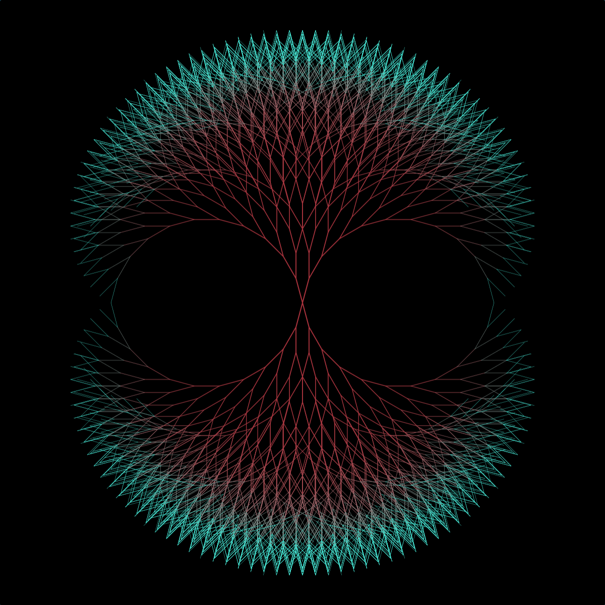
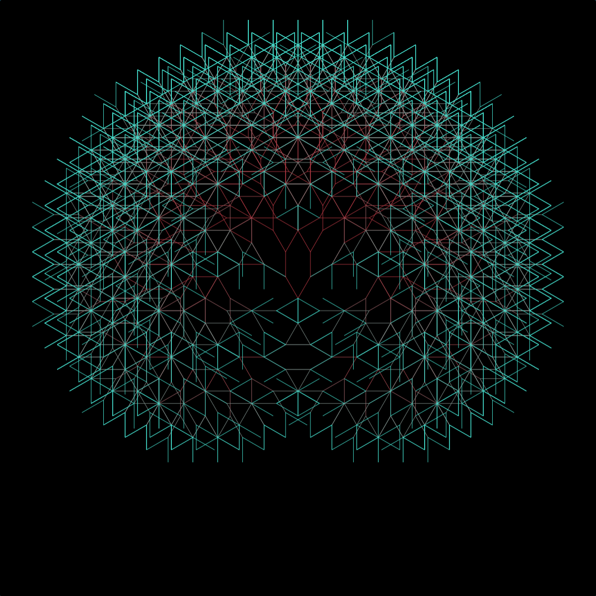
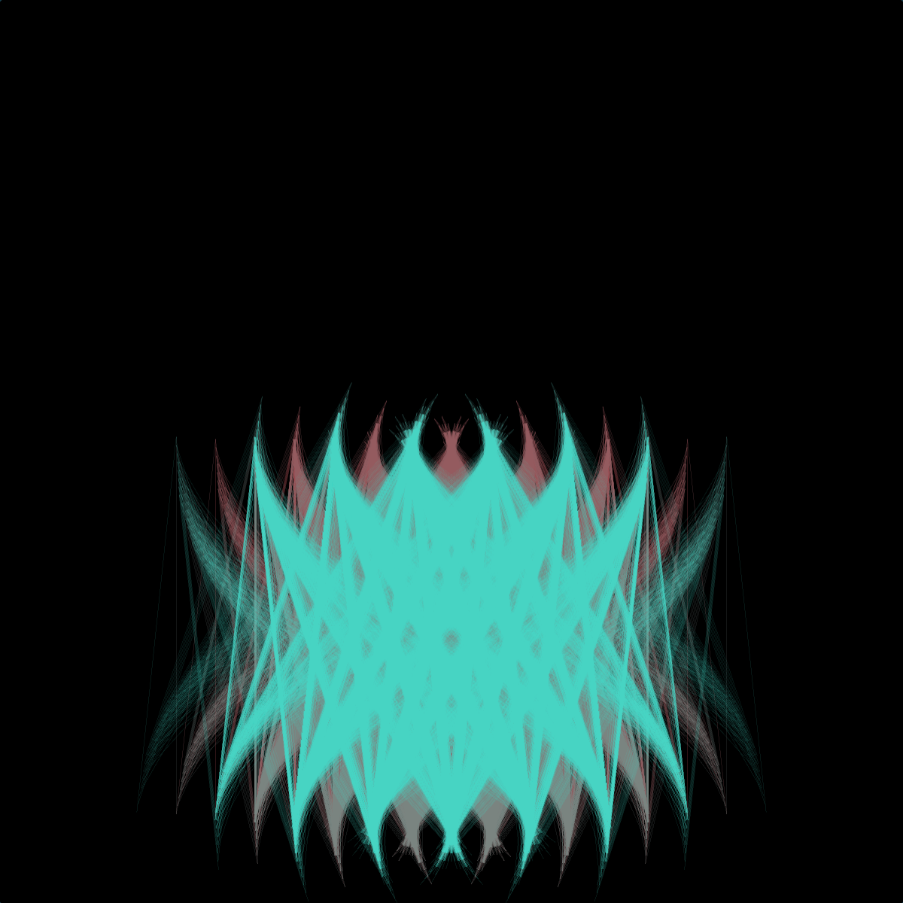
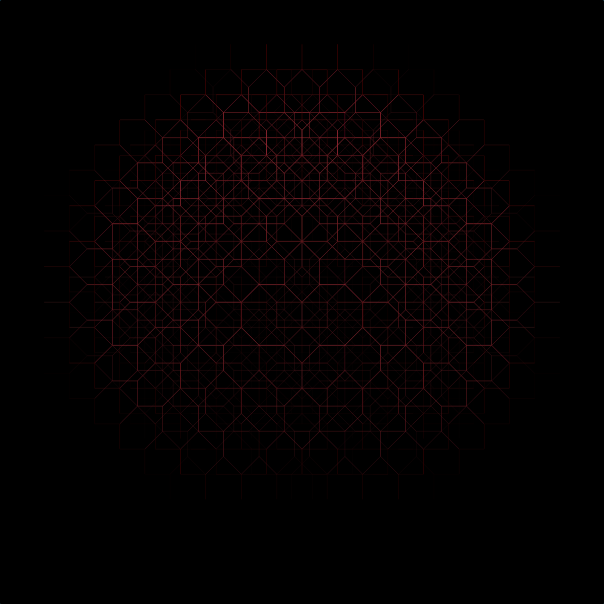
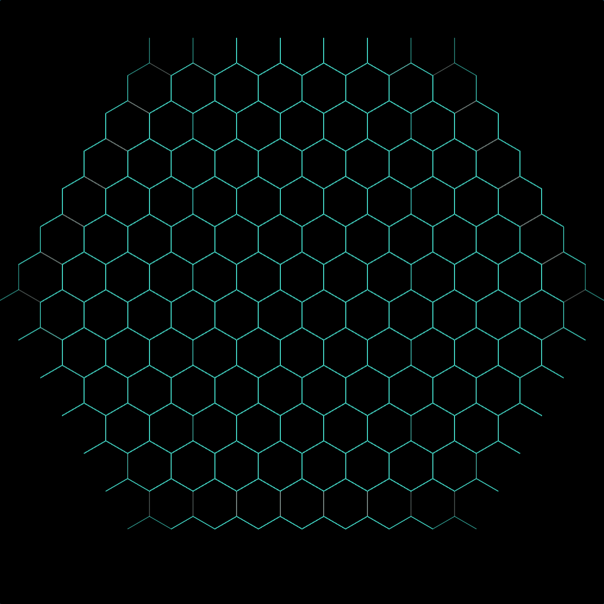
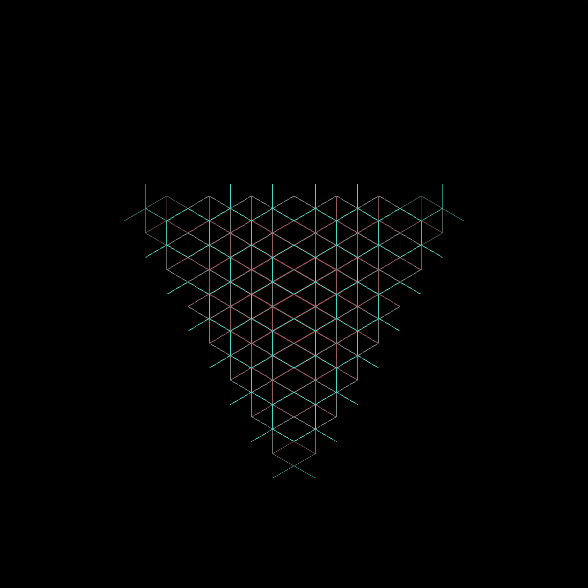
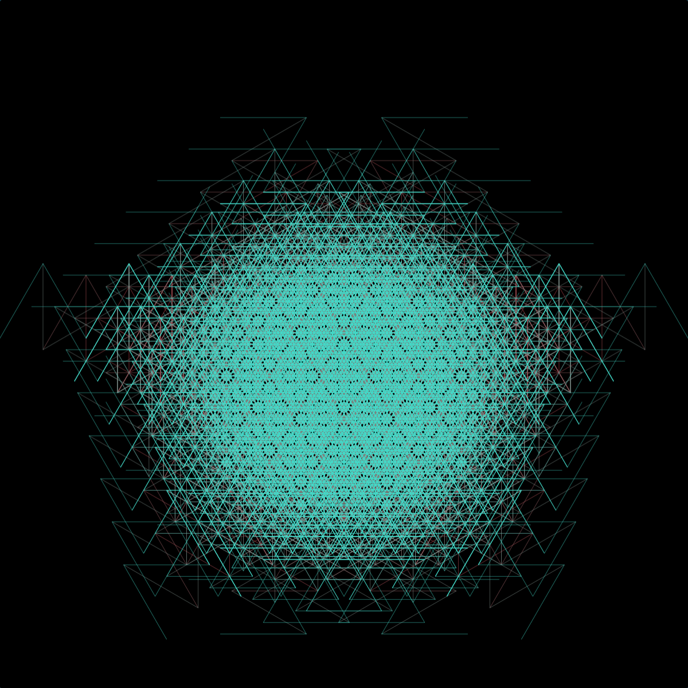

# Fractal Tree Visualiser

The Fractal Tree Visualiser provides a web interface for drawing and animating fractal trees, including settings for the structure and style of the displayed tree.

A fractal tree is a type of [binary tree](https://en.wikipedia.org/wiki/Binary_tree). Due to the efficient properties of binary trees they can often be found throughout nature: in trees, lightning, blood vessels, and the human pulmonary system (our lungs).

Despite their name, there are many fractal trees that don't resemble plants and some of these can be seen in the examples below.

## Examples

 

 

 

 

 
 

 

 

 
